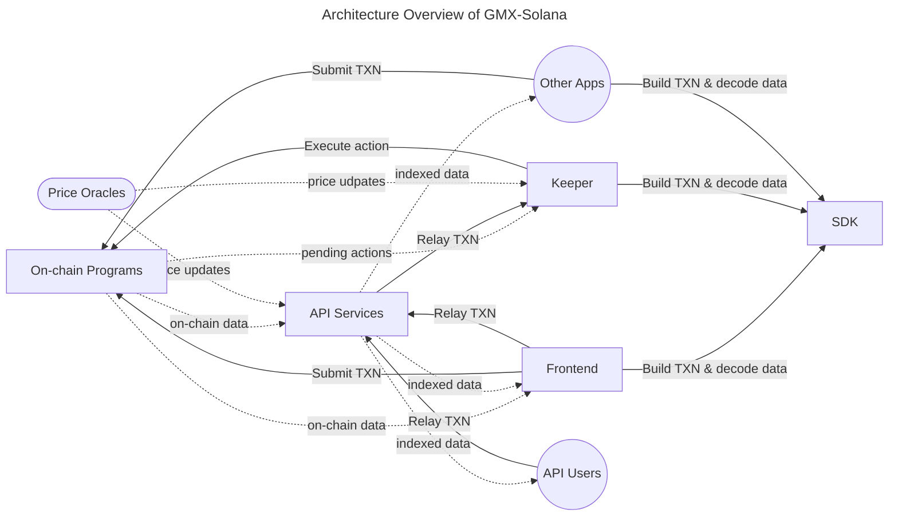

# System Overview

The diagram below shows the high-level architecture of GMX-Solana system:

## Detailed Architecture

### Public modules

- [On-chain Program architecture](programs/overview.md)
- [SDK architecture](sdk/overview.md)

### Internal modules (not publicly documented)
- Keeper architecture (Internal)
- Frontend architecture (Internal)
- API Services architecture (Internal)
